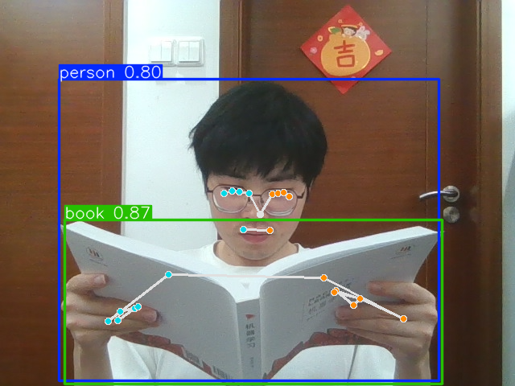
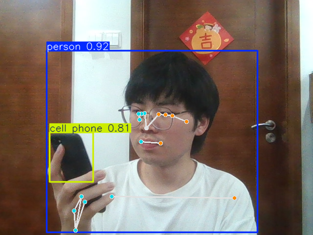

# AI-Based Examination Proctoring System Using Pose Estimation

Author: Zhang Tingwei (章廷瑋)

## 📌 Introduction

This project presents a lightweight, real-time AI proctoring system that integrates **YOLO-based object detection** and **MediaPipe Pose estimation** to identify both abnormal exam behaviors and prohibited items in computer-based tests. It aims to provide a cost-effective solution for automated invigilation using standard webcams and low-power devices.

## 🧠 Project Highlights

- Dual-model architecture using YOLO11n and MediaPipe Pose
- Real-time behavior and object detection
- Custom logic for identifying cheating behaviors such as looking away, using phones, or reading unauthorized materials
- Alarm triggering with annotated screenshots and logs

## 🖼️ Demo Screenshots

  
*Abnormal behavior detected: candidate reading from a book*

  
*Abnormal behavior detected: candidate using a mobile phone*

## 🎥 Demo Videos

- 📹 [Demo Video 1](./demo_video_1.mp4) – System functionality demonstration  
- 📹 [Demo Video 2](./demo_video_2.mp4) – Recording and alert screenshot feature in action

## 📄 Full Project Documentation

You can read the full report here:  
📄 [Project Introduction PDF](./Project_intro.pdf)

## 📂 Repository Structure 

```
.
├── Project_intro.pdf
├── demo_pic_1.png
├── demo_pic_2.png
├── demo_video_1.mp4
├── demo_video_2.mp4
├── README.md
```

## 🙋 About the Author

Zhang Tingwei is an undergraduate majoring in Artificial Intelligence at Jinan University. His interests include computer vision, human-computer interaction, and educational AI systems.

---

*This project was developed as part of my undergraduate thesis titled: "AI-Based Exam Proctoring System Using Pose Estimation".*
